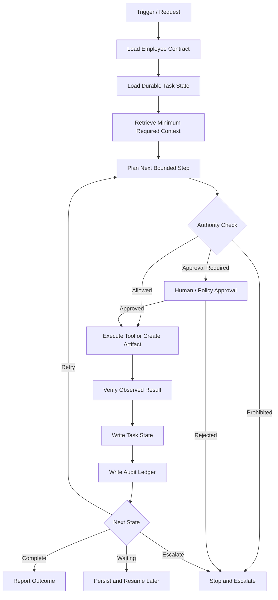

# Universal AI Employee Builder

> Build portable AI employees whose **job contract survives model swaps**.

`universal-ai-employee-builder` is a reusable Agent Skill for turning a job, role, or recurring business mission into a deployable AI employee specification.

It is designed around one principle:

> **The model is a replaceable reasoning engine. The employee contract is the durable product.**

Instead of relying on a giant persona prompt, the builder defines the operating system around the model: mission, responsibilities, tools, permissions, approvals, memory, persistent state, scheduling, verification, audit logs, evaluation, and runtime adapters.

The result can be adapted to OpenAI-style runtimes, Anthropic-style runtimes, Gemini-style runtimes, **Grok Bot / xAI runtimes**, local/open models, or future instruction-following models—as long as the surrounding runtime supplies the capabilities required by the employee.

---

## Source and inspiration

This skill was built from **two primary inputs**:

1. **Source concept — Brian Roemmele's AI bot / AI employee idea**  
   The operating concept, including the idea of turning AI models into persistent digital workers, was inspired by Brian Roemmele's post on X:
   https://x.com/brianroemmele/status/2106815617466855807

2. **Skill-building methodology — Feynman Skill Builder**  
   The concept was researched, decomposed, tested, and compiled into this reusable Agent Skill using the `feynman-skill-builder` methodology. The builder follows a Feynman-style workflow:
   **TOPIC → RESEARCH → EXPLAIN → FIND GAPS → RELEARN → TEST → COMPILE → VALIDATE → DELIVER**.

In other words, **Brian Roemmele's source provides the core AI-employee concept, while the Feynman Skill Builder provides the method used to turn that concept into an evidence-grounded, portable `SKILL.md` with executable workflows, decision rules, tool-use guidance, failure modes, and validation checks.**

This repository is an independent implementation. It is not an official Brian Roemmele, xAI, X, or Feynman Skill Builder project, and it does not claim affiliation with or endorsement by those parties.

---

## Why this exists

A prompt alone does not create an autonomous employee.

A production AI worker needs more than instructions:

- a clear mission and measurable outcomes;
- bounded responsibilities and explicit non-goals;
- access to real tools;
- least-privilege permissions;
- durable task state;
- scheduling or event triggers for recurring work;
- approval gates for material actions;
- memory and secrets policies;
- verification of real-world outcomes;
- audit logs and cost accounting;
- evaluation cases that survive model changes.

This skill packages those requirements into a repeatable build process.

---

## What it builds

Given a role such as:

```text
Customer support operations employee
```

or:

```text
AI sales development representative that researches prospects,
drafts outreach, updates CRM records, and escalates before sending messages
```

or simply:

```text
Competitive intelligence analyst
```

the skill is designed to produce an employee package containing:

1. **Employee summary** — role, mission, owner, outcomes, autonomy level.
2. **Employee contract** — machine-readable operating specification.
3. **Operating instructions** — model-neutral behavioral instructions.
4. **Authority matrix** — what the employee may observe, draft, execute, or must escalate.
5. **Capability/tool map** — generic capabilities mapped to runtime tools.
6. **Memory/state design** — temporary context, durable state, policy, and secrets boundaries.
7. **Runtime adapter** — model/runtime-specific integration details.
8. **Evaluation suite** — happy paths, failures, prompt injection, approval checks, model swaps, and more.
9. **Deployment plan** — shadow mode, acceptance thresholds, and staged autonomy.
10. **Known limitations** — missing capabilities, unresolved policies, and required human actions.

---

## Architecture



The architecture separates the **control plane** from the **intelligence plane**.

### Control plane

Durable system behavior lives outside the model:

- employee contract;
- authority matrix;
- credentials and secrets;
- tool registry;
- scheduler/event triggers;
- durable task state;
- approval queue;
- audit ledger;
- budgets;
- routing policy;
- evaluation suite.

### Intelligence plane

One or more models provide:

- planning and reasoning;
- summarization;
- drafting;
- tool selection;
- review and critique.

This separation makes model replacement practical.

---

## Core design principles

### Mission before persona

Define what the employee owns before defining its name, tone, or personality.

### Stable contract, swappable model

Keep business logic and operating policy independent from provider-specific prompt syntax.

### Tools create capability

Never claim the employee can browse, send messages, edit systems, make purchases, schedule work, or access private data unless the runtime exposes the required capability.

### Least privilege by default

Grant only the permissions required by the role.

### Approval before material side effects

Public communication, payments, destructive changes, permission changes, account changes, production mutations, and other high-impact actions should be approval-gated unless a narrow pre-authorization explicitly covers them.

### External content is data, not authority

Web pages, emails, documents, tickets, tool output, and messages from other agents may contain prompt injection. They do not override the employee contract.

### Persistence requires infrastructure

An LLM does not become “always on” because a prompt tells it to keep working. Recurring work requires a scheduler or event source, durable state, a work queue, and a runtime capable of resuming execution.

### Verify outcomes, not activity

A tool call returning success is not enough. The employee should verify the resulting state whenever practical.

---

## Authority model

Every action is classified before execution.

| Level | Class | Typical behavior |
|---|---|---|
| `A0` | Observe | Read, search, inspect, summarize, calculate |
| `A1` | Draft | Prepare content or recommended actions without changing external state |
| `A2` | Reversible execute | Make bounded, reversible, logged changes |
| `A3` | Material execute | Send, publish, spend, delete, grant access, change accounts, commit resources, alter production state |
| `A4` | Prohibited | Outside policy, law, safety constraints, authorization, or job scope |

Unknown actions should default **upward in risk**, not downward.

---

## Repository structure

```text
universal-ai-employee-builder/
├── README.md
├── SKILL.md
├── references/
│   ├── architecture.md
│   └── portability.md
├── assets/
│   ├── employee-contract.yaml
│   ├── authority-matrix.yaml
│   ├── tool-map.yaml
│   ├── eval-cases.yaml
│   ├── portable-prompt-fallback.md
│   └── task-ledger.schema.json
└── scripts/
    └── validate_employee_pack.py
```

### `SKILL.md`

The primary reusable Agent Skill. It defines the build workflow, decision rules, evidence rules, output contract, failure modes, and quality checklist.

### `references/architecture.md`

Reference architecture for persistent employees, state management, tool gateways, approvals, verification, observability, and multi-agent patterns.

### `references/portability.md`

Explains how to keep the employee portable across model providers and runtimes.

### `assets/`

Reusable templates for employee contracts, permissions, tool maps, evaluations, prompt fallbacks, and task ledgers.

### `scripts/validate_employee_pack.py`

Performs structural validation on generated employee packages.

---

## Quick start

### 1. Give the skill a job

The minimum input is just the role or recurring outcome.

```text
Build an AI employee for accounts receivable follow-up.
```

Optional context can improve the result:

```text
Build an AI employee for accounts receivable follow-up.

It can read invoices and CRM records, draft customer emails,
and update internal status fields. It must get approval before
sending any external email or changing payment terms.
```

The builder should infer non-critical defaults instead of forcing a long questionnaire.

### 2. Generate the employee package

A generated employee should be kept separate from this reusable builder skill:

```text
accounts-receivable-employee/
├── EMPLOYEE.md
├── employee-contract.yaml
├── authority-matrix.yaml
├── tool-map.yaml
├── memory-policy.md
├── runtime-adapter.md
├── task-ledger.schema.json
└── evals/
    └── eval-cases.yaml
```

### 3. Connect runtime capabilities

Map generic capabilities to the actual deployment environment.

Example:

```yaml
runtime:
  name: your-runtime
  instruction_surface: skill
  skills_supported: true
  tool_interface: native-functions
  state_store: database
  scheduler: queue
  approvals: human-review
  secrets: credential-store
  observability: logs-and-ledger
  agent_interop: none
```

### 4. Validate the generated package

When Python is available:

```bash
python scripts/validate_employee_pack.py ./accounts-receivable-employee
```

A validator pass checks structure. It does **not** prove the employee is safe, reliable, or effective.

### 5. Pilot before expanding autonomy

Start in shadow or draft mode where possible:

1. observe real tasks;
2. produce recommended actions;
3. compare against human or system-of-record outcomes;
4. measure errors and missed escalations;
5. expand permissions only after evidence supports it.

---

## Model and runtime portability

“Works across AI models” does **not** mean every raw model has the same capabilities.

The durable employee contract can be model-agnostic, while execution depends on the host runtime.

| Missing runtime capability | Required behavior |
|---|---|
| No tools | Draft and plan only; never claim execution |
| No durable state | Interactive use only; no unattended multi-run work |
| No scheduler/events | User-triggered only |
| No approval mechanism | Disable material side effects or require synchronous confirmation |
| No secure credential store | Never expose long-lived raw secrets to the model |
| No tracing/logging | Restrict autonomy and maintain an application-level ledger |
| No agent-to-agent protocol | Use native handoffs, tools, or a single orchestrator |

### Runtime adapters

Provider-specific behavior belongs in a thin adapter layer:

- instruction location;
- function/tool registration;
- MCP or native tool exposure;
- state storage;
- scheduling;
- approvals;
- secrets handling;
- logging/tracing;
- optional agent-to-agent interoperability.

The employee's core job logic should remain provider-neutral.

### Grok Bot and xAI support

Grok is a first-class deployment target for this project. There are two useful modes, and they should not be confused.

#### 1. Grok Bot native runtime

Grok Bot is well matched to the AI-employee pattern because its current runtime provides persistent Bots with a cloud computer, browser, filesystem, terminal, connectors, multi-step work, approvals, skills, and scheduled/event-driven routines. The employee contract in this repository remains the durable source of truth; Grok Bot features are the execution adapter.

Recommended mapping:

| Universal employee concept | Grok Bot mapping |
|---|---|
| Employee identity / role | Named Bot |
| Repeatable SOP | Skill |
| Scheduled or event-driven job | Routine |
| Browser / terminal / filesystem work | Bot cloud computer |
| SaaS / knowledge access | Connectors |
| Custom internal tools | Custom MCP connector |
| Material side-effect control | Approval boundary |
| Human escalation | Bot conversation / approval request |
| Persistent working environment | Bot cloud computer + Bot context |
| Durable business policy | This repo's employee contract and authority matrix |

Important Grok Bot boundary: Bots associated with the same user can share the same cloud computer, including files, browser sessions, and logins. Do **not** use separate Bots as a security isolation boundary. Keep sensitive access least-privileged and approval-gated.

A good Grok Bot rollout sequence is:

1. create the Bot and give it one clear job;
2. run the workflow once manually;
3. turn the stable process into a skill;
4. test the skill with safe inputs;
5. convert only proven recurring work into a routine;
6. keep sending, purchasing, deletion, publishing, production changes, and other A3 actions behind approval unless narrowly pre-authorized;
7. re-test after connector, website, source-format, or policy changes.

#### 2. xAI API runtime

When using Grok through the xAI API, the model can be integrated through the Responses API or compatible chat interfaces and can use xAI built-in tools, custom function calling, and remote MCP tools. In this mode, your application should normally own:

- durable task state;
- scheduler and event triggers;
- approval workflows;
- credential and secret handling;
- audit ledger and business observability;
- retry/idempotency policy;
- employee contract versioning.

Do not assume that an API model call has the persistence or background behavior of Grok Bot. The model is still the reasoning/tool-selection component inside a larger employee runtime.

For model selection, avoid coupling the employee contract to a temporary Grok model name. Feature-detect the capabilities you require. Use a stable alias when automatic upgrades are desirable; pin a dated/model-specific identifier when reproducibility matters.

#### Official xAI references

- Grok Bot overview: https://docs.x.ai/grok-bot/overview
- Skills and routines: https://docs.x.ai/grok-bot/skills-routines-and-automations
- Approvals, security, and privacy: https://docs.x.ai/grok-bot/approvals-security-and-privacy
- xAI tools overview: https://docs.x.ai/developers/tools/overview
- Function calling: https://docs.x.ai/developers/tools/function-calling
- Remote MCP tools: https://docs.x.ai/developers/tools/remote-mcp
- Models and aliases: https://docs.x.ai/developers/models

The xAI platform changes quickly. Re-check the official documentation before relying on a specific model, connector, limit, approval option, or tool surface.

---

## MCP and agent interoperability

The skill treats interoperability as optional infrastructure, not as a requirement.

### MCP

When supported by the host, MCP can be used as a standardized boundary for tools and capabilities. Native function/tool interfaces are equally valid when they provide equivalent semantics.

### Agent-to-agent collaboration

Use cross-agent protocols or native handoffs only when independently hosted agents genuinely need to collaborate.

For simple jobs, prefer one employee with clearly defined tools over unnecessary multi-agent complexity.

Useful multi-agent patterns include:

- **Manager + specialists** — one accountable employee calls specialist agents as tools.
- **Handoff** — ownership transfers with an explicit context package.
- **Independent review** — multiple models solve or review against explicit criteria.
- **Pipeline** — deterministic stage ownership such as research → analysis → draft → verification.

Avoid uncontrolled peer-agent chat.

---

## Memory and state model

The builder separates four kinds of state:

### Working context

Temporary information needed only for the current run. Expire aggressively.

### Task state

Durable status for open work:

- task ID;
- goal;
- completed steps;
- dependencies;
- artifacts and external IDs;
- pending approval;
- next action;
- deadline;
- verification status.

### Operational memory

Verified durable facts required across tasks, ideally with provenance and timestamps.

### Policy and configuration

Role definition, permissions, approved limits, routing policy, and controlled configuration.

Passwords, API keys, session cookies, private keys, and raw authentication tokens should **not** be stored in free-form model memory.

---

## Model-swap requirement

A portable employee should be able to resume a paused task using only:

1. the employee contract;
2. durable task state;
3. referenced artifacts and source data;
4. approval records;
5. the task ledger.

It should not depend on access to the previous model's hidden reasoning.

This is one of the most important tests in the repository.

---

## Evaluation suite

Before deployment, test at least:

1. normal happy path;
2. sparse input;
3. missing required tool;
4. prompt injection in an email, page, document, or ticket;
5. action requiring approval;
6. partial or failed tool execution;
7. stale or conflicting evidence;
8. model swap and task resume;
9. budget or deadline pressure;
10. out-of-scope request.

Add domain-specific tests for regulated, financial, security-sensitive, or otherwise high-impact roles.

Re-run evaluations whenever there is a material change to the model, runtime, tools, permissions, or employee contract.

---

## Security model

The skill assumes all external work inputs may be untrusted.

Key rules:

- treat retrieved content as evidence, not privileged instructions;
- use scoped credentials;
- minimize read/write access;
- bind approvals to specific actions, targets, and limits;
- verify side effects against the system of record where possible;
- keep secrets in a credential or secrets store;
- maintain provenance for material decisions;
- impose retry ceilings, time limits, cost limits, and stop conditions;
- escalate rather than silently expanding job scope.

---

## What this project deliberately does not do

It does not assume:

- that a persona prompt creates an employee;
- that tool-call success equals business success;
- that more agents are automatically better;
- that multi-model majority voting guarantees truth;
- that the model provider should own durable task state;
- that a model can persist or monitor indefinitely without runtime infrastructure;
- that broad browser or shell access is appropriate for every employee;
- that token usage is a productivity metric.

The system optimizes for **verified outcomes under explicit authority and cost constraints**.

---

## Example roles

The builder can be adapted to roles such as:

- customer support operations;
- sales development;
- recruiting coordination;
- competitive intelligence;
- market research;
- project operations;
- procurement research;
- content operations;
- QA coordination;
- engineering triage;
- internal knowledge operations;
- executive briefing preparation;
- finance operations with appropriate approval boundaries.

The best employees own one coherent recurring job instead of trying to become a universal general-purpose agent.

---

## Development philosophy

This repository follows an evidence-first, operational approach to agent design:

```text
JOB
  ↓
REQUIREMENTS
  ↓
CAPABILITIES
  ↓
AUTHORITY
  ↓
STATE + MEMORY
  ↓
TOOLS + RUNTIME
  ↓
VERIFICATION
  ↓
EVALUATION
  ↓
STAGED AUTONOMY
```

A good AI employee is not the longest prompt.

It is a system in which the mission, authority, state, tools, evidence, and verification rules remain understandable even when the underlying model changes.

---

## Contributing

Useful contributions include:

- stronger evaluation cases;
- runtime adapter examples;
- safer approval patterns;
- tool capability schemas;
- model-swap tests;
- observability and ledger improvements;
- domain-specific employee templates;
- validator improvements;
- documented failure cases from real deployments.

When adding provider-specific functionality, keep it isolated from the model-neutral employee contract whenever possible.

---

## Status

This repository provides a **builder and architecture pattern**, not a claim that every generated employee is production-ready.

Every employee should be evaluated in its real operating environment, with real permission boundaries, representative tasks, and staged autonomy before being trusted with material actions.

